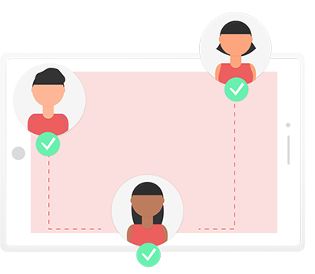

<!DOCTYPE html>
<html lang="sv">

<head>
  <title>Designgrupp 8</title>
  <meta charset="UTF-8">
  <meta name="viewport" content="width=device-width, initial-scale=1">
	<link rel="stylesheet" type="text/css" href="css/style.css">		<!--Denna länkning fungerar förutsatt att vi har den mappstruktur vi kommit överens om--> 
</head>
  
<body>
  <nav>
		
  		<a id="#what-nav" href="#what">Vad är profilen?</a>
  		<a id="why-nav" href="#why">Varför profilen?</a>
	  	<a id="who-nav" href="#who">Vem använder profilen?</a>
</nav>
<!--Detta ar ej slutgilftig illustration. bara en dummie tagen fran google-->

	
	
  <main>
	

	  <q>Ett banbrytande nytt koncept för streamingtjänster</q> 
		
-Testare

	

<article>
		
<h3 id="what">Vad är profilen?</h3>
	

	<ul>
       <li>Profilen är en helt ny funktion i SVT-play appen, användaren har i och med profilen fått en helt ny, egen och personlig sida.</li>
       <li>Här kan användaren följa både vänner och kändisar, samt dela med sig av sin egen profil till andra.</li> 
       <li>Genom att följa andras profiler kan användaren se om vännerna är online, vad andra tittar på just nu, vilka program som är andra användares favoritprogram samt följa andra användares senaste aktiviteter.</li>
       <li>Användaren kan själv välja hur mycket eller hur lite denne vill dela med sig av.</li>
	</ul>

	</article>
	<article>
	

		<q>Jag vet aldrig vad mina vänner tittar på, men med detta kommer jag att ha stenkoll!</q> 
		
-En person som tror på oss

	

		

<h3 id="why">Varför profilen?</h3>

	<ul>
        <li>Genom att introducera profilen skapar vi en mer levande app! Det finns nu fler saker att göra samt en möjlighet att interagera med andra.</li>
        <li>Vi skapar en större gemenskap då användarna kan kommunicera med varandra och prata om de program som finns på appen på ett enklare sätt än förut.</li>
        <li>Den nya profilen ger appen en modern tappning och gör den roligare att använda.
        </li>
	</ul>
	

</article>
<article>

	<q>Bästa appen - fem av fem!</q>
	
-Glad användare

<h3 id="who">Vem använder profilen?</h3>

<ul>
      <li>Personen som älskar att dela med sig av sitt liv i sociala medier.</li>
      <li>Personen som inte vill dela med sig av sitt liv, men älskar att följa andra genom sociala medier.</li>
      <li>Personen som både älskar att dela med sig av sitt liv, samt följa andra, i sociala  medier.</li>
      <li>Kända profiler som vill marknadsföra sig själva samt program som de medverkar i.</li>
      <li>Du - när du insett hur fantastisk den nya profilen är!</li>
</ul>

	</article>
</main>
  <a href="https://itunes.apple.com/se/app/svt-play/id343544214?mt=8" target="_blank">Ladda ner via App Store</a>
  <a href="https://play.google.com/store/apps/details?id=se.svt.android.svtplay&hl=en" target="_blank">Ladda ner via Google Play</a>

  
 
		<!--Allt i denna container blir centrerat horisontellt, med hjälp av stylesheetet-->
  
<a href="#top" class="btn">TILL TOPPEN</a>
		<!--Vi får aktivera länken senare, alltså koppla till banner när den finns. För jag antar att det kan bli problem om man länkar till nav-baren som är fast-->
 

  
<footer>
	
 Illustrationer är hämtade från <a href="https://undraw.co/" target="_blank">https://undraw.co/</a>. Övrigt material är vårt eget, &copy;2018 Designteam 8. All Rights Reserved.

</footer>

</body>
</html>
